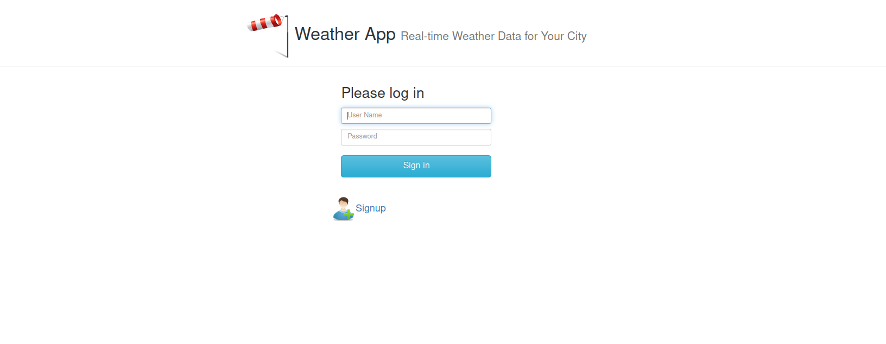
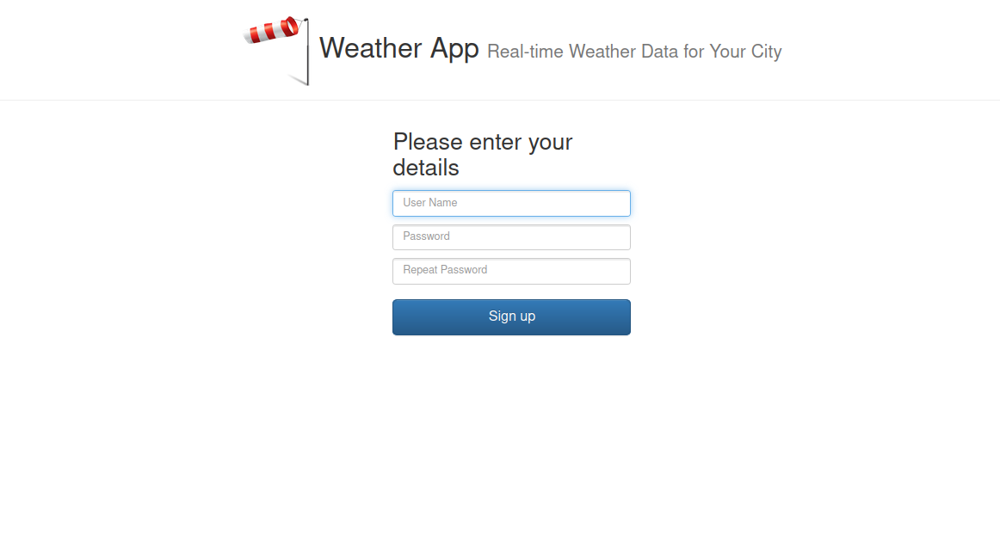
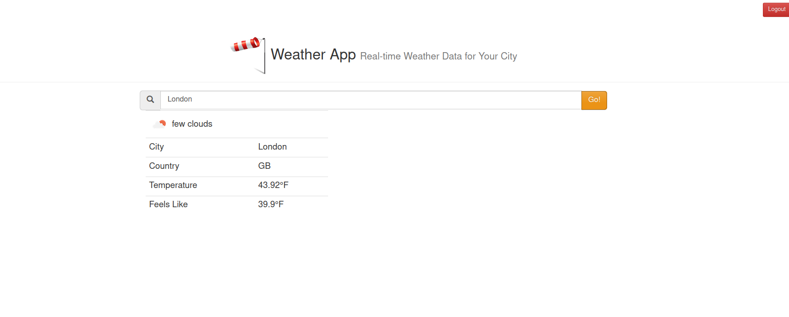

# 🌦️ Weather App

> **A simple web application to display weather conditions in different cities using the OpenWeather API.**

## 🚀 **Description**
This app allows users to search for the weather of any city and displays information such as:  
- Weather condition description 🌤️  
- Current temperature 🌡️  
- Feels-like temperature 👕  
- City and country name 🏙️  

## 🛠 **Technologies Used**
- **Frontend:** HTML, CSS, JavaScript, jQuery  
- **Backend:** Node.js, Express
- **Authentication Service:** Go  
- **API:** Rapid_API OpenWeather
- **Caching:** Nginx  
- **Containerization:** Docker, Docker-Compose  

---

## 📷 Application Screenshot

To add a screenshot of the application, place the image in the repository and reference it as shown below:

---

## ⚙️ DevOps & Infrastructure

This project was designed with full DevOps automation in mind, using modern tools and practices to provision, configure, and deploy the application.

### 🔧 Infrastructure as Code (Terraform)
- **Terraform** is used to provision the infrastructure on **AWS**.
- Resources created:
  - **VPC** with custom CIDR block.
  - **Public Subnet** for internet-facing services.
  - **EC2 Instance** to run the containerized app.
  - **S3 Bucket** for storing assets or logs.
  - **Security Groups** for controlled network access.

---

### ☁️ Cloud Hosting (AWS)
- All infrastructure is hosted on **Amazon Web Services (AWS)**.
- The EC2 instance runs a Linux-based OS and hosts the containerized application stack.
- Network and storage are managed using AWS-native services provisioned via Terraform.

---

### 📦 Containerization (Docker & Docker Compose)
- Each service (UI, API, Auth, DB) runs inside its own **Docker container**.
- **Docker Compose** defines the full multi-service architecture in a single YAML file, enabling consistent local or production deployments.

---

### ☸️ Container Orchestration (Kubernetes)

- **Kubernetes** is used to orchestrate and manage containerized services at scale.
- The application components (frontend, backend, auth service, database) are deployed as separate **Pods**.
- Kubernetes resources used in this project:
  - **Deployments** for managing replica sets and rolling updates.
  - **Services** (ClusterIP / NodePort) to expose internal and external communication.
  - **ConfigMaps** and **Secrets** to handle environment variables and credentials securely.
- Helps ensure high availability, self-healing, and scalability of the application.
- Ideal for production-grade workloads with automated rollouts and resource monitoring.

---

### 🔄 CI/CD Pipeline (Jenkins)
- **Jenkins** is used for automating the build and deployment process:
  - Monitors changes via GitHub.
  - Builds Docker images.
  - Pushes to a container registry (if configured).
  - Deploys to the EC2 instance or Kubernetes cluster.
- Notifications are sent to developers via **Slack** once the pipeline completes.

---

### ⚙️ Configuration Management (Ansible)
- **Ansible** playbooks are used to configure the EC2 instance:
  - Install required packages and tools.
  - Deploy the Docker Compose.
  - Ensure consistent and repeatable setup across environments.

---

## 🚀 Overview

The **Weather App** is a full-stack web application designed to retrieve and display real-time weather data for any city using the OpenWeather API. It showcases essential weather metrics such as temperature, conditions, and location details through a user-friendly interface.

Beyond its frontend functionality, this project serves as a practical environment to apply and demonstrate modern **DevOps practices**. It includes full automation of infrastructure provisioning, configuration management, continuous integration and deployment, container orchestration, and cloud deployment — making it an ideal case study for end-to-end DevOps pipelines.

---

